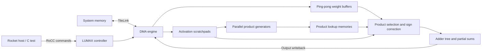
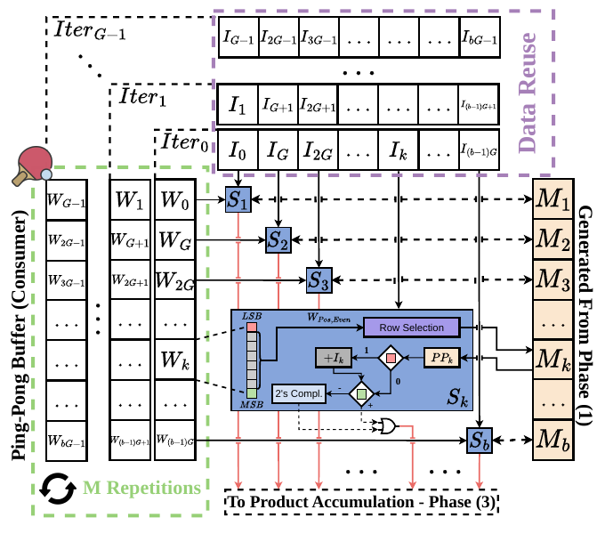

# Accelerator design

[Project overview](../README.md) · [Performance model](../Performance%20Modeling/README.md) · [Measurements](software/tests/README.md)

The manuscript uses **LUMIXED** for the architecture; this generator uses the Scala package `LUMAX_PACKAGE`. This guide maps the manuscript's Sections 3.1–3.5 to the checked-in implementation.

## System and dataflow

For `X[N,K] × W[K,M]`, an activation window covers part or all of one input row. Its products stay resident while all `M` weight columns are processed. Larger `K` requires additional windows, whose contributions accumulate into the same outputs. The reference configuration processes one activation row at a time (`y_slice=1`).

*Manuscript Figure 1, PDF page 3. Architectural stages are product generation, selection, and accumulation. Performance counters additionally separate input loading and output storage.*

## Lookup memories and precision

Each memory bank has `n = 64 × RF` rows for the default maximum 8-bit weight precision and minimum 2-bit precision. Only positive even multiples of an activation's magnitude are stored; zero is handled without a nonzero product lookup. This needs `2^(Wwidth−2)` rows per activation, one quarter of a table enumerating all `2^Wwidth` weight bit patterns.

Products are generated with repeated additions of `2 × abs(x)`. At 16-bit activation precision one product occupies a row; at 8-bit precision two activation products can be packed into a row. The maximum activation capacity per bank is:

$$
A_{\mathrm{per\ bank}} = 2^{8-W_{\mathrm{width}}}\frac{16}{I_{\mathrm{width}}}RF,
\qquad AW=\min(b A_{\mathrm{per\ bank}},K).
$$

For example, with `b=2`, `RF=8`, and 16-bit activations, the capacity across banks is 16 activations at 8-bit weights, 256 at 4-bit weights, or 1024 at 2-bit weights, capped by `K`. These are capacities, not products issued per cycle.

## Product selection and accumulation

*Manuscript Figure 2, PDF page 4. Each weight selects a product for its corresponding activation; the same activation products are reused across columns.*

The selector unpacks signed weights, determines a product address, restores the sign using activation and weight signs, and corrects odd weights. A bank-wide adder tree combines selected products, and output registers retain partial sums across windows. Sub-byte weights are packed into memory transfers rather than expanded to byte-sized values.

**Paper/RTL detail:** the manuscript describes an odd weight using the lower even product plus one activation. The current RTL instead indexes the upper even product and subtracts the signed activation. With `q=abs(w)>0`, its row within an activation block is `q/2−1` for even `q`, and `(q−1)/2` for odd `q`; rows store `2|x|, 4|x|, …`. Thus `|w|=3` selects `4|x|` and subtracts `|x|`. Both reconstruct the same integer product. The manuscript's printed `log2` row-selection expression is not the RTL address calculation; use [LUMAX_Top.scala](src/main/scala/LUMAX_Top.scala) as the implementation reference. Historical failing tests are documented separately and are not resolved by this mathematical equivalence.

## Pipelining and weight buffering

*Manuscript Figure 3, PDF page 5. FI: input fetch; PG: product generation; FW: weight fetch; PS: product selection; Acc: accumulation; SA: output storage.*

Two weight buffers implement producer/consumer overlap: DMA fills one while selection consumes the other. Pipelining overlaps address processing, synchronous reads, correction, and accumulation. The model therefore uses the slower of weight fetching and selection to estimate steady-state cost per column. Input/product setup and output writeback still contribute to total latency.

The hardware declares activation scratchpads (`I_MEM`), double-buffered weight scratchpads (`W_MEM`), product memories (`temp_muls_mem`), and output registers (`O_reg`). Chisel `SyncReadMem` describes the memory behavior; whether FPGA synthesis maps it to distributed memory or BRAM depends on configuration and synthesis.

## Configuration and software interface

The current defaults in [Config.scala](src/main/scala/Config.scala) are:

| Parameter | Default | Meaning |
|---|---:|---|
| `x_slice` | 2 | Banks per activation vector; paper `b` |
| `y_slice` | 1 | Parallel activation rows; use 1 for the paper equations |
| `Mem_row_factor` | 8 | Paper `RF`; gives 512 product rows per bank |
| `XBitWidth`, `minInputBits` | 16, 8 | Activation precision bounds |
| `WBitWidth`, `minWeightBits` | 8, 2 | Weight precision bounds |
| `OutBitWidth` | 32 | Output/accumulation width |
| `DMA_bits`, `DMA_Bytes` | 64, 8 | Transfer width |
| `Dma_Ids` | 2 | Maximum outstanding DMA requests; paper evaluation uses 4 |
| `W_BUFFS` | 2 | Ping-pong weight buffers |
| `SCALE` | false | Optional scaling path disabled |
| `DEBUG` | true | Hardware debug/performance-counter support |
| `Rin`, `Cin`, `Cout` | 1, 1000, 1000 | Elaboration sizing parameters for counters/storage |

Hardware geometry is chosen at elaboration. Runtime commands supply addresses, dimensions, precision information, loop counts, and start/control operations. `Linear-sw.c` wraps the custom instructions and handles quantization, packing, and weight transposition. Keep its `XS`, `YS`, `Mem_row_factor`, maximum precisions, and `SCALE` consistent with the hardware; ensure runtime dimensions fit the elaborated storage/counters.

RoCC function codes are decoded in `LUMAX_Top.scala`: 0–5 configure addresses/dimensions and execution metadata, 6 controls busy state, 7 supplies scale data, 8 configures element precision, 9 reads performance counters, and 10 starts execution. Consult the C wrappers and RTL together for the packed command fields.

## Source map

| Source | Responsibility |
|---|---|
| [LUMAX_Top.scala](src/main/scala/LUMAX_Top.scala) | RoCC integration, controller, memories, selection pipeline, accumulation, and counters |
| [Config.scala](src/main/scala/Config.scala) | `LUMAXParams` and current defaults |
| [DMA.scala](src/main/scala/DMA.scala) | TileLink client, request IDs, transfers, and responses |
| [Product_Generator.scala](src/main/scala/Product_Generator.scala) | Packed product generation by shifts and additions |
| [MappingUtils.scala](src/main/scala/MappingUtils.scala) | Bank/index mapping utilities |
| [ChunkInfoModules.scala](src/main/scala/ChunkInfoModules.scala) | Transfer chunk/address bookkeeping |
| [SignExtractor.scala](src/main/scala/SignExtractor.scala) | Packed activation extraction and sign extension |
| [Scale.scala](src/main/scala/Scale.scala) | Optional integer-to-floating-point scaling support |
| [Linear-sw.c](software/tests/src/Linear-sw.c) | Host setup, packed operands, software reference, correctness checks, and timing |

The paper evaluates `b ∈ {4,8,16,32}` and `n ∈ {64,512}`. The current `b=2` default and historical test configurations should not be described as identical to that evaluation sweep.
