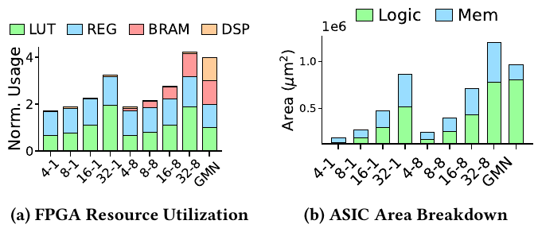
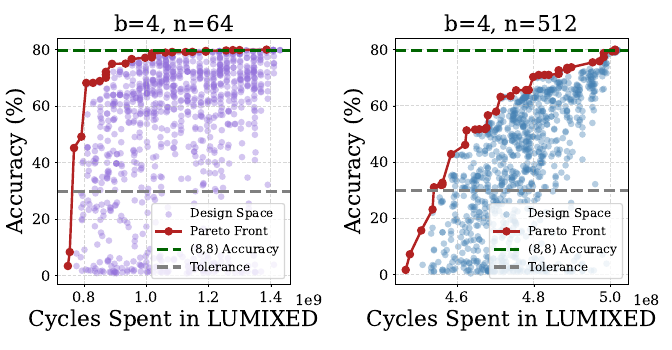
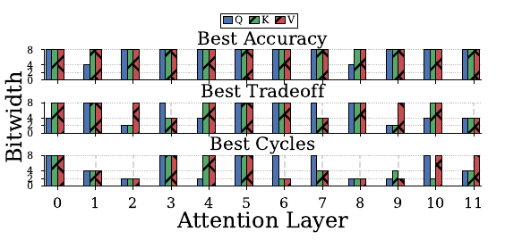

# Measurements and reproduction

[Project overview](../../../README.md) · [Accelerator design](../../README.md) · [Performance model](../../../Performance%20Modeling/README.md)

This guide distinguishes three sources of results: the supplied LUMIXED manuscript, historical Verilator logs committed under [src/Log](src/Log), and estimates from the Python model. The tables below describe the original historical snapshot. For the current Chipyard 1.13.0 workflow and new verification, see [the version-specific guide](../../../chipyard-1.13.0/README.md).

## Experimental setup reported in the paper

| Item | Manuscript setup (Section 4.1) |
|---|---|
| Integration | Rocket-hosted accelerator, RoCC commands, TileLink DMA |
| DMA | 64-bit transfers, four concurrent requests |
| Hardware sweep | `b ∈ {4,8,16,32}`, `n ∈ {64,512}`; `RF=n/64` |
| Precisions | 8/16-bit activations, 2/4/8-bit weights, 32-bit outputs |
| FPGA | AMD ZCU106, Vivado 2022.1, up to 100 MHz |
| ASIC | GlobalFoundries 22 nm; Synopsys Design Compiler; up to 1 GHz |
| ASIC timing corner | SSG, 0.65 V, 125 °C |
| ASIC power corner | TT, 0.8 V, 25 °C |
| GeMM workload | C LLaMA2 implementation with TinyStories-15M |
| Comparison | Gemmini 4×4 PEs; INT8 operands; up to 70 MHz on FPGA |

The checked-in default uses `b=2` and two DMA request IDs, so it is not the same as the paper setup. FPGA frequency figures and ASIC synthesis estimates refer to different platforms and evaluation methods.

## Paper performance and resource results

Table 3 of the manuscript reports the following **cycle speedups relative to Gemmini 4×4**. Values below 1 mean more cycles than the baseline. Relative power is `P_LUMIXED / P_Gemmini`, an FPGA power estimate, not energy per operation. Clock differences must be considered separately when converting cycle ratios to elapsed-time speedups.

| `b` | `n` | Relative power | A16/W8 | A16/W4 | A16/W2 | A8/W8 | A8/W4 | A8/W2 |
|---:|---:|---:|---:|---:|---:|---:|---:|---:|
| 4 | 64 | 0.291 | 0.20 | 1.70 | 1.73 | 0.40 | 1.70 | 1.82 |
| 8 | 64 | 0.317 | 0.40 | 2.35 | 3.56 | 0.73 | 2.29 | 3.60 |
| 16 | 64 | 0.329 | 0.72 | 2.36 | 4.56 | 1.17 | 2.40 | 4.63 |
| 32 | 64 | 0.402 | 1.21 | 2.38 | 4.56 | 1.21 | 2.40 | 4.64 |
| 4 | 512 | 0.329 | 1.05 | 1.79 | 1.83 | 1.13 | 1.80 | 1.81 |
| 8 | 512 | 0.382 | 1.12 | 2.35 | 3.55 | 1.17 | 2.38 | 3.60 |
| 16 | 512 | 0.462 | 1.15 | 2.37 | 4.56 | 1.21 | 2.40 | 4.63 |
| 32 | 512 | 0.683 | 1.20 | 2.37 | 4.56 | 1.22 | 2.40 | 4.73 |

*Transcribed from manuscript Table 3, PDF page 7. `A` and `W` denote activation and weight precision. Raw Gemmini runs and FPGA power reports are not included in this snapshot.*



*Manuscript Figure 4, PDF page 7. Axis labels use `b–RF`, whereas Table 3 uses `b–n`; `n=64×RF`. GMN denotes Gemmini. The FPGA panel normalizes each resource separately; the sum of its stacked components is not an absolute resource count.*

Larger windows reduce repeated input/product setup; more banks increase selection parallelism. Once external transfers dominate, increasing either bank count or depth gives diminishing returns. The paper describes shallow memories mapping to FPGA LUTs and deeper memories using BRAMs; its ASIC flow maps memories to technology-library macros.

Section 4.4 reports up to **62 GOP/s** on FPGA for `b=32,n=512`, and peak **2 TOPS/W** ASIC computational efficiency with data resident on chip. Footnote 3 reports approximately **300 GOPS/W** including memory-loading latency. These scopes should be retained when citing results. The text also reports 8 DSPs in Section 4.2 but 62 GOP/s and 6.2 GOP/s/DSP in Section 4.4, which imply 10 DSPs if the same accounting scope is used; the supplied manuscript does not resolve that difference.

## ViT mixed-precision exploration



*Manuscript Figure 5, PDF page 8: ViT-B/32 design-space exploration for `b=4` with `n=64` and `n=512`. Each point represents a Q/K/V weight-precision assignment; red points form the Pareto frontier.*

The paper fixes activations at 8 bits and varies Q/K/V weights among 2, 4, and 8 bits. Its NSGA-II search uses 10 parents, 100 candidate evaluations per generation, 10 generations, and mutation probability 0.1. Candidates are calibrated over 20 batches with Brevitas and evaluated on CIFAR-100 using PyTorch; the execution environment includes NVIDIA V100 and A30 GPUs.



*Manuscript Figure 6, PDF page 8: selected best-accuracy, tradeoff, and best-cycle configurations for `n=512`.*

The manuscript reports 8.5% mean relative cycle-model error, and theoretical exploration-time speedups of 1295× over Verilator and 70× over FPGA execution. These are exploration-time comparisons, not inference speedups. The repository contains the cycle-model scripts, but not the complete search implementation, calibrated checkpoints, candidate measurements, or validation dataset needed to reproduce Figures 5–6 or those aggregate statistics.

## Saved simulation results

The 49 `.txt` logs under `src/Log` record older `DataReuseRocketConfig` runs in a Chipyard 1.13.0 environment. Filenames encode matrix dimensions and precisions; parent directories encode `XS`, `YS`, and `Mem_row_factor`. They do not record a source commit, all DMA settings, or a complete toolchain manifest.

| Saved configuration | PASS | FAIL | Incomplete |
|---|---:|---:|---:|
| `XS=2, YS=1, RF=1` | 4 | 0 | 0 |
| `XS=2, YS=1, RF=8` | 15 | 8 | 1 |
| `XS=4, YS=1, RF=8` | 9 | 12 | 0 |
| **Total** | **28** | **20** | **1** |

PASS means the saved C test reports all outputs matching its software reference. Of the 20 FAIL logs, 19 report output mismatches and one (`XS=2,RF=8,N=1,K=M=512,A16/W8`) records a simulator assertion/abort without cycle measurements. Those runs do not establish correct accelerator performance. The incomplete `XS=2,RF=8,N=1,K=M=512,A16/W4` log stops after matrix generation. These historical failures do not identify which version or component caused them, and were not debugged as part of the documentation update.


*Generated from saved logs, not from the paper: `N=1`, `K=M`, 16-bit activations, `YS=1`, `RF=8`. Circles/lines show passing runs; crosses show failing runs for diagnosis. Incomplete runs have no plotted cycle count. Lines connect sampled cases and are not predictions for unsampled dimensions.*

The [CSV export](../../../docs/assets/measurements/saved-simulation-cycles.csv) preserves every parsed log, its status, result detail, counters, configuration, and source path. Missing measurements remain blank. `status=UNKNOWN` identifies the incomplete run. There are 46 logs with all four stage counters and a printed total; the passing `XS=2,RF=8,N=1,K=64,M=1,A16/W8` log has stage values but no printed total. Regenerate both CSV and plot from the repository root:

```bash
python3 docs/plot_saved_measurements.py
```

This command needs Matplotlib. It reads existing logs, checks that complete stage totals equal the sum of their four components, and writes documentation assets. It does not launch a simulator.

## Interpreting the counters

[Linear-sw.c](src/Linear-sw.c) times the CPU reference and host accelerator call with `rdcycle()`. With performance counters enabled, it also reads separate hardware stage counters.

| Log label | Meaning |
|---|---|
| `SW Mat-Mul` | CPU cycles for the software reference multiplication |
| `HW Mat-Mul` | Host-bracketed cycles around `preload_hw` and `matmul_hw_uniform` |
| `Load X` | Accelerator activation-loading stage |
| `Generate BRAMs` | Product generation; label does not guarantee FPGA BRAM mapping |
| `Load W and Select` | Combined overlapped weight-fetch/selection stage |
| `Store O` | Accelerator output-write stage |
| `Load W Alone`, `Select Alone` | Separate activity counters; do not add them to the combined stage |
| `Total` | Sum of the four main accelerator stages |

For the [passing `XS=2,RF=8,N=1,K=M=64,A16/W4` example](src/Log/XS=2_YS=1_Mem_row_factor=8/RIN=1_CIN=64_COUT=64_INBITS=16_WBITS=4.txt):

| Quantity | Saved cycles |
|---|---:|
| Load X | 87 |
| Generate BRAMs | 160 |
| Load W and Select | 2,369 |
| Store O | 269 |
| Accelerator stage total | 2,885 |
| Host-bracketed HW Mat-Mul | 4,768 |
| Software Mat-Mul | 907,312 |

Host-bracketed time includes work outside the accelerator's stage counters. Compare an accelerator cycle model with the accelerator stage total, and report host-bracketed time separately. This example's CPU software reference is not the paper's Gemmini baseline. Its printed `X Slice=16` is derived as `XS×RF`; the hardware bank count remains `XS=2`.

For a specified measured cycle scope `C` and clock `f` in Hz, elapsed time is `C/f`. Counting a multiply and an add as two operations, nominal GeMM throughput is `2NKM f / (C×10^9)` GOP/s. State the clock, operation-count convention, correctness status, and whether transfer/host overhead is included. Energy efficiency additionally requires power measured or estimated for the same scope; cycle logs alone cannot establish TOPS/W.

## Running new experiments

1. Follow the [Chipyard integration and simulation instructions](../../../README.md#integrate-into-chipyard). Select `LUMAXROcketConfig`, and rebuild after modifying hardware parameters.
2. In [Config.scala](../../src/main/scala/Config.scala), select bank count, row factor, DMA settings, and sizing parameters. For the paper setup use four request IDs and a 64-bit transfer width. Keep `y_slice=1` for comparisons with the documented model.
3. In [Linear-sw.c](src/Linear-sw.c), set `RIN_MAX`, `CIN_MAX`, `COUT_MAX`, `IN_BITS`, and `W_BITS`; match `XS`, `YS`, `Mem_row_factor`, and scaling settings to RTL. Keep `fast_mode=false` and `ultra_fast_mode=false` so correctness is actually checked. `PC_COUNTERS=1` enables counter reporting; use a compatible hardware `DEBUG` setting.
4. For bare metal use `BAREMETAl_NEW=0` and `bash build.sh baremetal`. Set `Debug=0` if matrix dumps are not needed. Follow the root README's simulator commands and save stdout/stderr with the configuration metadata.
5. Require an explicit correctness PASS before treating timing as validated. Record source revisions, tool versions, complete hardware parameters, clock, dimensions, precision, timing scope, and repeat-run variation.

The updated [parameter script](src/run_param_test.sh) defaults to `LUMAXROcketConfig`, edits C defines in place, and checks both simulator completion and the exact C correctness result. It uses `pipefail` and returns nonzero on failures. [The 1.13 guide](../../../chipyard-1.13.0/README.md) documents host-prepared vectors, the original on-core path, and waveform runs.

For FPGA measurements, complete `KostisZCU106Config` as described in the root README and record the implemented clock and tool reports. For Linux, also set `BAREMETAl_NEW=1`, compile with `bash build.sh linux`, and supply a matching `/dev/my_accel` driver, DMA buffer mapping, and Linux boot environment. The build script does not switch the C mode macro. This repository does not supply the driver, full board boot image, ASIC technology libraries, or complete paper workloads; the manuscript's full evaluation cannot be reproduced solely from these files.
