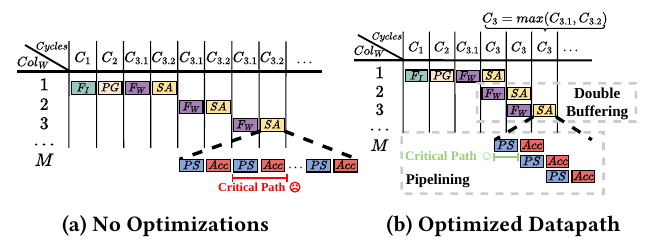

# Performance models

[Project overview](../README.md) · [Architecture](../LUMAX/README.md) · [Measurements](../LUMAX/software/tests/README.md)

[Model.py](Model.py) estimates accelerator cycles and operation counts. [Model_Plot.py](Model_Plot.py) supplies notebook-oriented plots and interactive controls. The supplied manuscript develops the analytical model in Sections 3.1–3.6, Equations (1)–(9). **The checked-in Python model differs from those equations**, as detailed below; its outputs are estimates, not measured execution times.

## Parameters

For `X[N,K] × W[K,M]`, the paper and code use these names:

| Paper | Python argument | Hardware/software counterpart |
|---|---|---|
| `N`, `K`, `M` | `Rin`, `Cin`, `Cout` | Runtime matrix dimensions in the C test |
| `Iwidth` | `in_bits` | Activation precision: 8 or 16 |
| `Wwidth` | `w_bits` | Weight precision: 2, 4, or 8 |
| `b` | `XS` | `x_slice`, banks per activation vector |
| `RF` | `factor` | `Mem_row_factor`; `n=64×RF` |
| One row at a time | `YS=1` | `y_slice=1`; matches the paper's equations |
| `DMA_ID` | `ID` | `Dma_Ids` |
| `DMA_WIDTH` | `DMA_WIDTH` | `DMA_bits`, in bits, not bytes |
| `Imax`, `Wmax` | `IN_MAX=16`, `W_MAX=8` | Maximum supported precisions |
| `TRT` | DMA helper's `L` | Assumed request round-trip latency |

Use positive dimensions, bank counts, row factors, and request counts. `compute_cycles` does not validate these arguments. Keep `YS=1` for comparisons with the manuscript. Its broader `YS` parameterization is not established as a validated multi-row implementation by the supplied results.

## Paper equations

Let `p = Imax / Iwidth` be the number of activation products packed per row. The number of activations per bank, window size, bank occupancy, and number of windows are:

$$
A_{\mathrm{per\ bank}}=2^{W_{\max}-W_{\mathrm{width}}}pRF,
\quad AW=\min(bA_{\mathrm{per\ bank}},K),
\quad G=\left\lceil\frac{AW}{b}\right\rceil,
\quad R=N\left\lceil\frac{K}{AW}\right\rceil.
$$

Product-generation cost per window (Equation 5):

$$
C_2=G\left(2^{W_{\mathrm{width}}-2}+1\right)/p.
$$

The optimized selection/accumulation cost per column is `C3.2 = 1 + G + 2`. With double buffering (Equation 6):

$$
C_3=M\max(C_{3.1},C_{3.2}).
$$

The paper's approximate DMA transfer model, for a nonempty payload of `B` bits (Equation 7), is:

$$
T_{\mathrm{DMA}}(B)\approx T_{RT}+
\frac{T_{RT}}{DMA_{ID}}
\left(\left\lceil\frac{B}{DMA_{WIDTH}}\right\rceil-1\right).
$$

The manuscript uses a 64-bit transfer width, four outstanding requests, and `TRT=6` cycles. Equation 8 sets `C3.1 = TDMA(G b Wwidth)`. The total model (Equation 9), with 32-bit outputs, is:

$$
C_{\mathrm{total}}=
\left[T_{\mathrm{DMA}}(GbI_{\mathrm{width}})+C_2+C_3\right]R
+N\,T_{\mathrm{DMA}}(32M).
$$

These equations treat window costs uniformly and approximate pipeline overlap. Tail windows, padding, request scheduling, and startup/drain behavior can cause differences from actual hardware. The closed-form DMA approximation is calibrated to the paper's settings, not a general bus simulator; for example, it has no explicit one-request-per-cycle issue limit.



*Manuscript Figure 3, PDF page 5. Overlap motivates the `max(load, select)` term.*

## What the Python implementation computes

`compute_cycles` returns four accumulated stages: `cycles_load_X`, `cycles_generate_Products`, `cycles_loadW_select`, and `cycles_store_output`, plus their sum `total_cycles`. `Repeat activation Window` is the window count. `cycles_3_1` and `cycles_3_2` describe one weight-fetch and selection step, while `cycles load w Only` and `cycles select Only` estimate those activities without overlap.

The helper `dma_finish_time_exact_bits` schedules `ceil(B/DMA_WIDTH_bits)` single-beat requests. For request `k`, issue time is the previous issue time plus `t_issue`, additionally constrained by completion of request `k−ID` when the outstanding-request limit is reached. Completion is issue time plus `L`; the last completion gives transfer time. “Exact” refers to this simplified scheduling model, not to complete TileLink or DRAM behavior. The `beat_time` argument is currently unused.

| Aspect | Manuscript | Checked-in Python |
|---|---|---|
| DMA timing | Closed-form Equation 7, `TRT=6` | Request-by-request schedule; `compute_cycles` forces `HS=8`, overriding its argument |
| Weight-column count | `M × max(load, select)` | `(Cout−2) × max(load, select)` per window |
| Small output dimensions | Positive column count | At `Cout=1`, the weight/select term is negative; at `Cout=2`, it is zero |
| Payload with bank padding | Equations use `G×b` | Input and weight transfers use capped window size; occupancy uses per-bank padding |
| Partial windows | Uniform repeated cost | Also repeats a full-window cost, without separately pricing the final tail |
| Packed generation | Analytical `G/p` | Can return fractional cycle estimates; no final integer-cycle rounding |
| Buffer/cache controls | Two buffers in the evaluated architecture | `buffers_w`, `extra_prefetch_cycles`, `cache_8_4`, `cache_reads`, and `IN_min` do not alter the calculation |
| Operation counts | Separate from cycle model | Mixed scopes; see below |

Do not use `Cout≤2` estimates as valid predictions. The `Cout−2` adjustment has no matching fill/drain compensation in the returned total and should not be silently equated with Equation 6. This documentation records the current behavior without changing model semantics.

Operation counters need particular care: `LoadOp`, `AddOp`, `ShiftOp`, `ReadSramOp`, and `WriteSramOp` are incremented during one window's calculation, but weight-related increments do not include all `Cout` columns. `WriteOp` already includes the number of output row groups. `plot_operations_total` multiplies most counters by window count only; its “total” plots are not validated whole-GeMM operation or energy counts.

## Run an estimate

In a Python environment with `matplotlib`, `seaborn`, and `ipywidgets` installed, run from this repository's root:

```bash
cd "Performance Modeling"
python3 - <<'PY'
from Model import compute_cycles

result = compute_cycles(
    Rin=1, Cin=64, Cout=64,
    in_bits=16, w_bits=4,
    XS=2, YS=1, ID=2,
    factor=8, DMA_WIDTH=64,
)
for key in (
    'Repeat activation Window', 'cycles_load_X',
    'cycles_generate_Products', 'cycles_loadW_select',
    'cycles_store_output', 'total_cycles',
):
    print(f'{key}: {result[key]}')
PY
```

For this example, the checked-in model returns **2,524 cycles**: 65 input-load, 160 generation, 2,170 weight/select, and 129 output-store cycles. This is a model output, not a new simulation. The [final matching configuration log](../LUMAX/software/tests/src/Log/run_20261008_193240/b2_rf8/tests/X1x64_W64x64_A16_W4.log) reports 2,851 accelerator-stage cycles. The log does not record every model assumption, so this single example does not establish model accuracy.

## Interactive plots

Start a Jupyter notebook with its working directory set to `Performance Modeling`, and run:

```python
%run Model.py
%run Model_Plot.py
```

The first cell loads `compute_cycles` and shared imports into the notebook namespace. The second creates sliders and plots for stage cycles and operation counts. `Model_Plot.py` relies on those shared names and is not a standalone command-line program. The widget's initial parameters are demonstration values, not the current Scala configuration. Interpret operation-count plots with the limitations above.

The manuscript reports **8.5% mean relative error** across its LLaMA2/ViT GeMM validation. That aggregate is a paper result; the supplied scripts/logs do not contain the full validation dataset or reproduce that aggregate. See [measurements](../LUMAX/software/tests/README.md) for the evidence actually present here.
