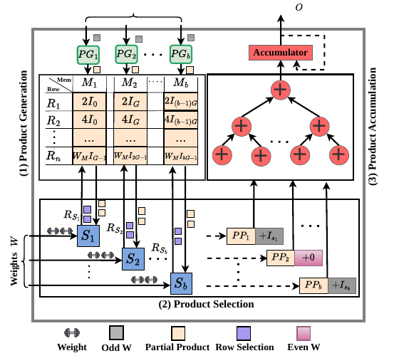
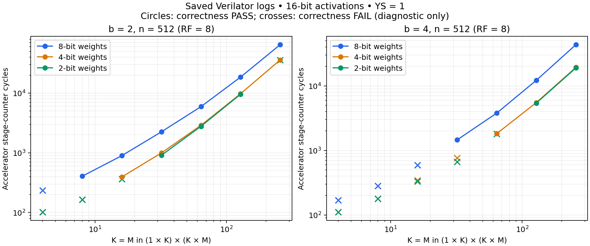

# LUMAX / LUMIXED

LUMAX is a Chisel implementation of a lookup-table-based, mixed-precision matrix multiplication accelerator integrated with Rocket through RoCC and TileLink DMA. The accompanying manuscript calls the architecture **LUMIXED: LUT-Based MIXED-Precision GeMM Accelerator for Quantized DNN Inference**; source packages and build configurations retain the **LUMAX** name.

The accelerator computes `O[N,M] = X[N,K] × W[K,M]`, supporting 8- or 16-bit activations, 2-, 4-, or 8-bit weights, and 32-bit accumulation. It precomputes positive even activation products, reuses them across weight columns, and reconstructs signed products during selection. Pipelined selection and accumulation overlap with weight fetching through two weight buffers.



*Figure 1 from the supplied manuscript, PDF page 3. [Figure provenance](docs/README.md).*

## Documentation

| Topic | Contents |
|---|---|
| [Fast plug-and-run guide](FAST_PLUG_AND_RUN_README.md) | Previous quick-start integration and run instructions |
| [Accelerator design](LUMAX/README.md) | Dataflow, memory organization, precision, configuration, and source map |
| [Performance models](Performance%20Modeling/README.md) | Paper equations, Python usage, assumptions, and implementation differences |
| [Measurements and reproduction](LUMAX/software/tests/README.md) | Saved simulation results, counters, benchmark instructions, FPGA/ASIC results, and ViT plots |
| [Figures and data](docs/README.md) | Paper attribution and scripts to regenerate documentation assets |

This repository is an integration overlay for Chipyard, not a complete standalone Chipyard checkout. **The active simulation target is Chipyard 1.13.0**; use the [1.13 integration guide](chipyard-1.13.0/README.md). The completed October 8 six-configuration sweep records **162 PASS and 18 FAIL out of 180 tests**, with hardware cycle counters; see the [sweep guide](chipyard-1.13.0/CONFIG_SWEEP.md) and [saved report](LUMAX/software/tests/src/Log/config_sweep_20261008_020603_1120408/REPORT.md). This snapshot precedes the diagnosed address-width and parallel-sum-width fixes. The original integration guide targets **Chipyard 1.11.0**, and the older historical logs contain **28 PASS, 20 FAIL, and one incomplete run**; those are a separate result set.

## Repository layout

| Path | Purpose |
|---|---|
| `LUMAX/src/main/scala/` | Accelerator RTL generator and parameters |
| `LUMAX/software/tests/src/` | C matrix multiplication test, build scripts, and saved logs |
| `Performance Modeling/` | Analytical cycle model and notebook-oriented plots |
| `LUMAXConfigs.scala` | `chipyard.LUMAXROcketConfig` SoC configuration |
| `Configs.scala` | Rocket subsystem configuration customizations |
| `build.sbt` | Chipyard build overlay with the `LUMAX` project |
| `fpga/` | FPGA platform and ZCU106 support overlay |

## Integrate into Chipyard

For **Chipyard 1.13.0**, follow [the version-specific integration guide](chipyard-1.13.0/README.md), which preserves the newer Chipyard build and Rocket APIs. The table below describes the older 1.11 overlay; use it only with its original compatible workspace:

| Repository source | Destination relative to the Chipyard root |
|---|---|
| `LUMAX/` | `generators/LUMAX/` |
| `build.sbt` | `build.sbt` |
| `fpga/` | `fpga/` |
| `Configs.scala` | `generators/rocket-chip/src/main/scala/subsystem/Configs.scala` |
| `LUMAXConfigs.scala` | `generators/chipyard/src/main/scala/config/LUMAXConfigs.scala` |

The supplied `build.sbt` declares the accelerator project and adds it to Chipyard. The SoC configuration uses `LUMAX_PACKAGE.WithLUMAXAccelerator` and a custom medium Rocket core configuration. Hardware parameters live in [Config.scala](LUMAX/src/main/scala/Config.scala).

## Run a bare-metal simulation

From the **Chipyard root**, load the environment and build the simulator:

```bash
source env.sh
cd sims/verilator
make CONFIG=LUMAXROcketConfig
```

In `generators/LUMAX/software/tests/src/Linear-sw.c`, set the dimensions and precisions, keep `BAREMETAl_NEW=0`, and match `XS`, `YS`, and `Mem_row_factor` to the Scala configuration. Then, from the Chipyard root:

```bash
cd generators/LUMAX/software/tests/src
bash build.sh baremetal
cd ../../../../../sims/verilator
./simulator-chipyard.harness-LUMAXROcketConfig \
  ../../generators/LUMAX/software/tests/src/Linear-sw.riscv
```

For a waveform run, from `sims/verilator`:

```bash
make CONFIG=LUMAXROcketConfig run-binary-debug \
  BINARY=../../generators/LUMAX/software/tests/src/Linear-sw.riscv
```

Inspect the simulator's reported waveform path with GTKWave. The spelling **`LUMAXROcketConfig`** is intentional and matches the checked-in class.

The updated `run_param_test.sh` defaults to `LUMAXROcketConfig`, uses deterministic vectors and exact output checks, and returns a failure status on simulation or correctness errors. Its arguments are `RIN CIN COUT [IN_BITS] [W_BITS] [debug]`; it modifies `Linear-sw.c` in place. `CONFIG=DataReuseRocketConfig` selects the compatibility alias in Chipyard 1.13.

## FPGA and Linux

The FPGA make target is:

```bash
# From the Chipyard root, after completing the board configuration:
cd fpga
make SUB_PROJECT=kosszcu106 bitstream
```

**The checked-in board configuration needs completion first.** `kosszcu106` selects `KostisZCU106Config` in [the ZCU106 configurations](fpga/src/main/scala/zcu106/Configs.scala). Its active chain contains `WithZCU106Tweaks`, while the base SoC selections are commented out. Compose the board tweaks with an accelerator-enabled SoC configuration and verify its clock/core settings before building; this snapshot is not a ready-to-build reproduction of the paper's FPGA system.

For Linux, set `BAREMETAl_NEW=1` in `Linear-sw.c`, then run `bash build.sh linux` from the test source directory. The build script selects the compiler but does **not** change that macro. Execution requires a suitable Linux-capable SoC, boot image, and `/dev/my_accel` DMA-buffer driver implementing the test's `mmap` and `GET_PHYS_ADDR` interface. That driver and boot image are not included here. See [measurement prerequisites](LUMAX/software/tests/README.md#running-new-experiments).

## Results at a glance

The supplied manuscript reports FPGA operation up to **100 MHz / 62 GOP/s**, ASIC synthesis up to **1 GHz**, and peak on-chip compute efficiency of **2 TOPS/W**. Its footnote reports approximately **300 GOPS/W** when memory-loading latency is included. These are manuscript results with different measurement scopes, not fresh measurements of this checkout.



The plot is generated from the repository's historical logs. Crosses indicate failed correctness checks and are diagnostic data only. [Measurement details, paper plots, and reproduction steps](LUMAX/software/tests/README.md).
